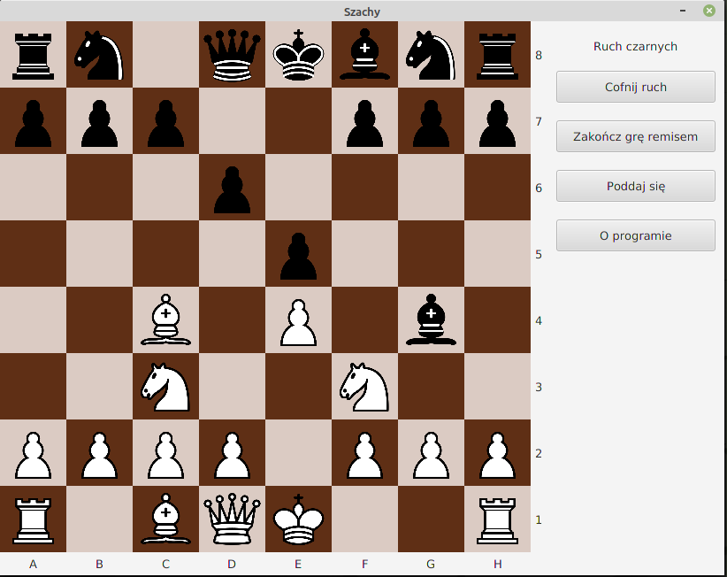

# Szachy

Simple chess game implemented in JavaFX



## Download
You can get an executable JAR file from releases section. To run game on Linux system type the following command: 

````
$ java -jar szachy.jar
````

Game was tested on Linux Mint 20 with installed JavaFX and JavaFXSVG dependencies.

## License

Game is using chess pieces icons from [wikimedia](https://commons.wikimedia.org/wiki/Category:SVG_chess_pieces).
